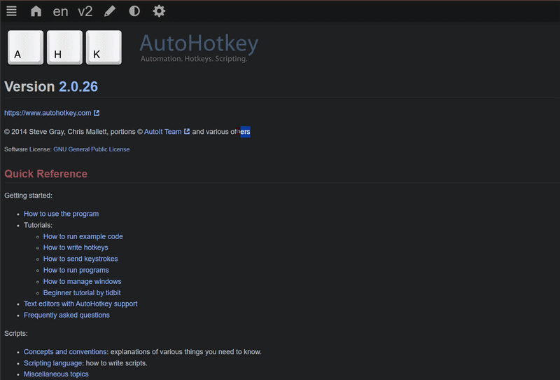
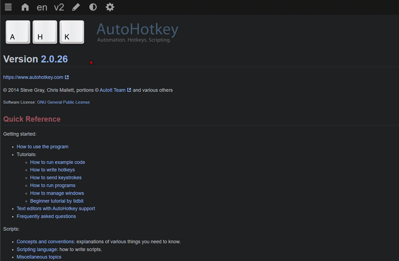
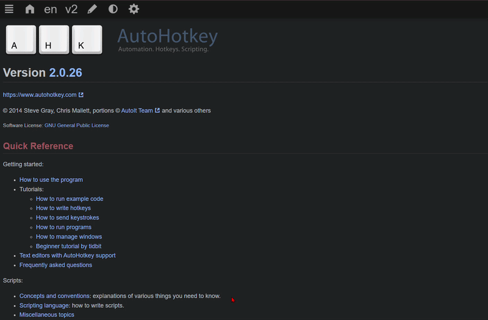
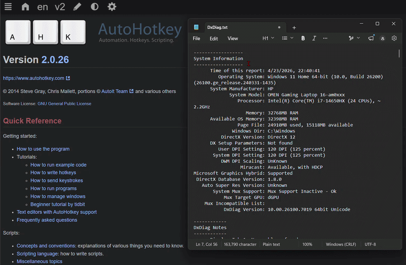

# Clipboard Manager

A lightweight Windows clipboard history manager built with AutoHotkey v2.

Capture, search, pin, preview, and paste previous clipboard items — with configurable privacy exclusions and local persistence.

Clipboard contents stay on your machine and are **never sent to a remote server**.

Official AHK v2 docs: [https://www.autohotkey.com/docs/v2/](https://www.autohotkey.com/docs/v2/)

## Demo

### Clipboard history

Copy text → press `Win+V` → select an entry → paste.



### Image preview

Images are detected separately and displayed with a side preview.



### Search & pinning

Search through your history and keep important entries pinned.



### Application exclusions

Clipboard capture can be disabled for password managers and other user-selected applications.



## Features

- Clipboard history for text, images, and files
- Searchable history
- Pin important entries
- Image thumbnails and previews
- Configurable history size
- Persistent text and image history
- Application-specific clipboard exclusions
- Pause/resume clipboard monitoring
- Auto-delete old unpinned entries
- Clear unpinned history on Windows shutdown / logoff (default on)
- Start with Windows
- Configurable global hotkey
- Tray integration

## Privacy

Clipboard history is stored **locally** next to the script. The application does **not** upload clipboard contents anywhere.

Clipboard capture can be disabled for password-manager applications and any custom applications you specify.

Built-in exclusions (when enabled) include:

- KeePass
- KeePassXC
- 1Password
- Bitwarden
- LastPass
- Dashlane
- Enpass

You can add any other `.exe` name in Settings. Built-ins can be unchecked; customs can be added or removed.

> The application does **not** inspect clipboard content to decide whether it is a password. Exclusions are based on the **application** that had focus when the clipboard changed.

## Requirements

- Windows
- [AutoHotkey v2](https://www.autohotkey.com/)

## Quick start

1. Double-click `ClipboardManager.ahk` (or run it with AutoHotkey v2).
2. Copy text, images, or files as usual.
3. Press **Win+V** (default) to open history, or use the tray icon → **Open History**.
4. Select an item → **Paste** (or double-click / Enter).

Close the picker with the window **X** or **Esc**. If history is empty, the manager still opens and shows an in-window empty state.

## Settings

Open **Settings** from the tray or the history window. Values are stored in `ClipboardManager.ini`.

| Setting | Meaning |
|---------|---------|
| Shortcut | Keyboard shortcut used to open the clipboard history (default `#v` = Win+V) |
| Max history size | Max items kept (default 40) |
| Auto-delete hours | Remove unpinned items older than this (`0` = off) |
| Exclude password-manager applications | Master switch for built-in password managers |
| Excluded apps list | Scrollable checklist (built-in + custom). Checked = excluded |
| Add / Remove | Add a custom `.exe` (saved immediately); remove selected custom |
Start with Windows | Adds/removes Clipboard Manager from the applications automatically launched when the user signs in to Windows.
| Clear unpinned on shutdown / logoff | On shutdown or logoff, drop unpinned history before save; pinned items stay. Tray Exit does not clear. |

## Persistence

- **Text** entries are saved to `history.json` (atomic write via a temp file).
- **Images** are saved as full PNGs (plus preview thumbs) under `media\`; paths and metadata go in `history.json`. They survive restart like text (same pin / clear / auto-delete / shutdown-clear rules).
- **Files and other** types stay in memory for the current session only and are **not** restored after restart.
- With **Clear unpinned on shutdown / logoff** enabled (default), unpinned text and images (and their `media\` files) are removed on Windows shutdown or logoff. Pinned items are kept. A crash or force-kill skips exit handlers, so history may still be on disk.

## Image preview

Copied images appear as distinct rows (e.g. `Image 15:32:08 - 1920x1080`). The history window stays compact until you **select an image**, then it expands with a side thumbnail. Full images and thumbs live under `media\`.

## Tray menu

| Item | Action |
|------|--------|
| Open History | Opens the history picker |
| Pause / Resume Monitoring | Stops or resumes capturing new clipboard changes |
| Settings | Opens the settings window |
| Exit | Quits the script (does not clear unpinned history) |

## Project layout

```text
ClipboardManager.ahk    Entry point
README.md
docs/                   Demo GIFs for this README
lib/                    Application modules
ClipboardManager.ini    User settings (created on first run; gitignored)
history.json            Persisted text + image metadata (gitignored)
media/                  Persisted image PNGs + thumbs (gitignored)
ClipboardManager.log    Diagnostics log (gitignored)
```

```text
lib/
  Config.ahk            INI load/save, built-in exclusions
  History.ahk           In-memory history CRUD, pins, limits
  ImageThumb.ahk        GDI+ image save/load, thumbs, paste-from-file
  Capture.ahk           OnClipboardChange, pause, exclusions
  Persistence.ahk       Text + image save/load, exit cleanup
  Hotkeys.ahk           Dynamic hotkey bind/rebind
  GuiHistory.ahk        History picker, search, image side preview
  GuiSettings.ahk       Settings UI + startup shortcut
  Tray.ahk              Tray menu
  Logger.ahk            Simple file logging
```

## Architecture

One AutoHotkey process; behavior split into modules with dependencies flowing inward toward app state (no circular `#Include`s):

```text
ClipboardManager.ahk
        │
        ├── Capture
        ├── History
        ├── Persistence
        ├── ImageThumb
        ├── Hotkeys
        ├── GuiHistory / GuiSettings
        ├── Tray
        ├── Config
        └── Logger
```

Runtime data stays outside version control: `ClipboardManager.ini`, `history.json`, `media/`, `ClipboardManager.log`.

## Tech

- AutoHotkey v2
- Windows
- INI configuration
- JSON persistence
- GDI+ for image handling

## Hotkey examples

| Setting value | Keys |
|---------------|------|
| `#v` | Win+V |
| `^!v` | Ctrl+Alt+V |
| `^+v` | Ctrl+Shift+V |

See [Hotkeys](https://www.autohotkey.com/docs/v2/Hotkeys.htm) in the AHK v2 docs.

## Notes

- `#SingleInstance Force` — starting the script again replaces the previous instance.
- If **Win+V** does nothing, Windows Clipboard history or another app may own that shortcut; change the hotkey in Settings.
- Keep the script running (tray icon) for monitoring to work.
